# **MSUroll** 抢课神器指南

## 目录
- [入坑须知](#desc)

- [mac 安装](#mac-setup)

- [windows 安装](#win-setup)

- [使用说明](#intro)

- [问题反馈与技术交流](#feedback)

# <a name="desc"/>
## 入坑须知
> `起源`：本人为 MSU 大四 CSE 学生。由于大一时抢不到专业课，便立志有朝一日必写一个“抢课程序”。加之毕业在即，本人利用平常空闲时间开发了MSUroll，希望可以为抢课烦恼的同学们带来帮助。
>
> `简介`：MSUroll有以下两点主要功能
> - *秒 enroll*（如果该课有位置，可以在 3 秒内完成 enroll）
> - *秒抢课* （如果该课已满，能在第一时间检测到有人drop，并自动完成 enroll）
>
> `注意`：MSUroll **不是黑客攻击程序**，所以不存在违反校规校纪的情况。全程操作属于 **合法合规** 地选课。
>
> `源代码`: [Github](https://github.com/by-the-w3i/MSU_ROLL) , [Documents](https://by-the-w3i.github.io/MSU_ROLL/)

# <a name="mac-setup"/>
## MAC 安装
**step 0: 检查 Mac 版本**
> Mac 系统版本 必须 >= `10.13.1` `macOS High Sierra`， 否则 MSUroll 将无法运行

**step 1: 下载 MSUroll APP**
> 下载 `MSUroll_disk.dmg`：[https://github.com/by-the-w3i/MSU_ROLL/releases](https://github.com/by-the-w3i/MSU_ROLL/releases)


**step 2: 安装 MSUroll 及 chromedriver 插件**
> 打开 `MSUroll_disk.dmg`
>
> 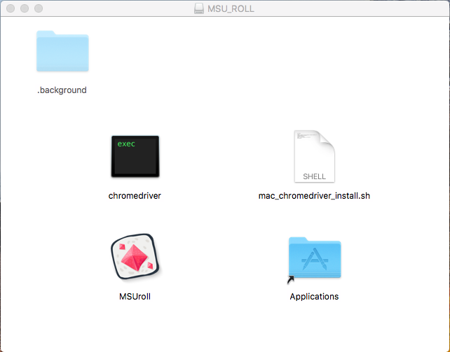
>
> `spotlight` 搜索 `terminal` 并回车
>
> 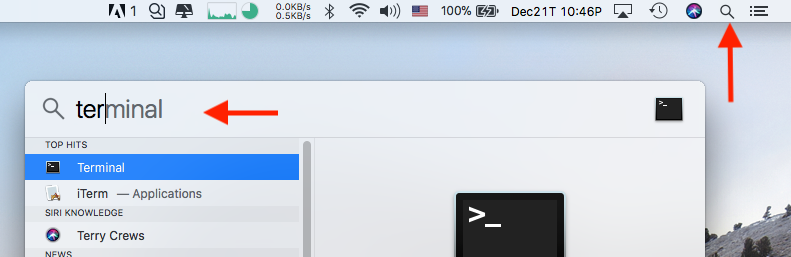
>
> 在 `terminal` 里粘贴以下代码并回车
>
> ```bash
> sh /Volumes/MSU_ROLL/mac_chromedriver_install.sh
> ```
> 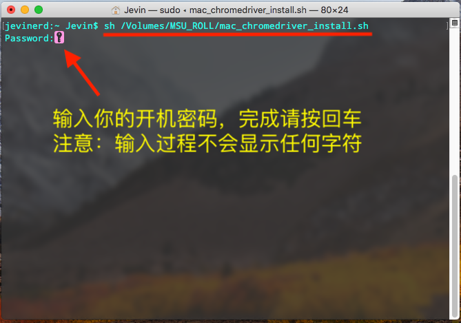
>
> 在 `terminal` 输入以下代码， 检查 `chromedriver`  插件是否成功安装
>
> ```bash
> ls /usr/local/bin/ | grep chrom
> ```
> 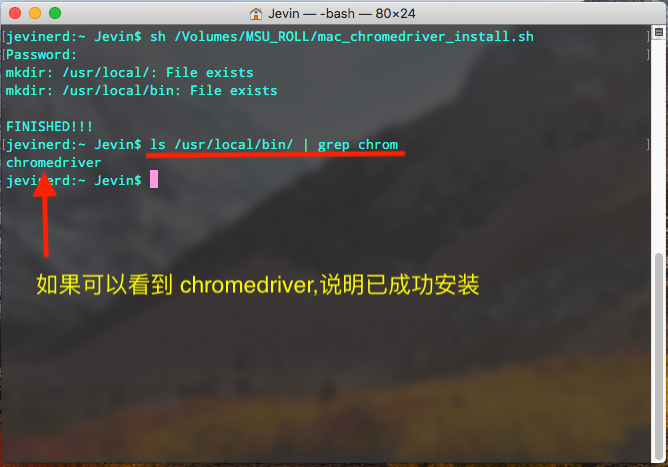
>
> 将 MSUroll 拽入 *应用程序文件夹* (`Applications`)
>
> 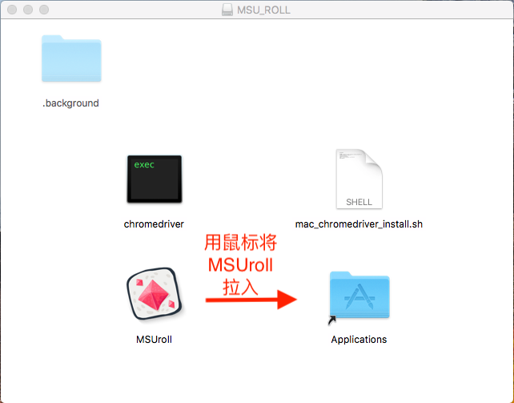
>
> 打开程序
>
> 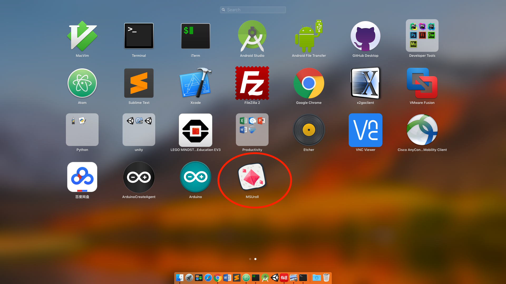
>
> 如果碰到以下问题：
>
> 
>
> 解决方案：
>
> ```
> System Preferences >> Security & Privacy >> open MSUroll anyway
> ```
>
> 
>
> 成功打开 APP
>
> 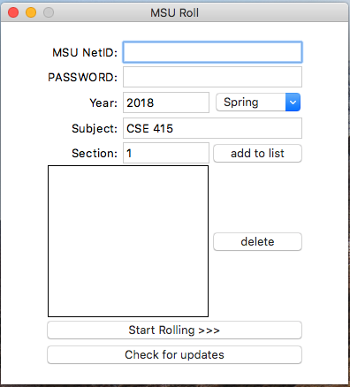

**step 3：传送至[使用说明](#intro)**

# <a name="win-setup"/>
## Windows 安装
**step 1: 下载 MSUroll APP**
> 下载 `MSUroll_win.zip` : [https://github.com/by-the-w3i/MSU_ROLL/releases](https://github.com/by-the-w3i/MSU_ROLL/releases)

**step 2: 安装 MSUroll**
> 解压 `MSUroll_win.zip` 得到 `MSUroll_win` 文件夹
>
> 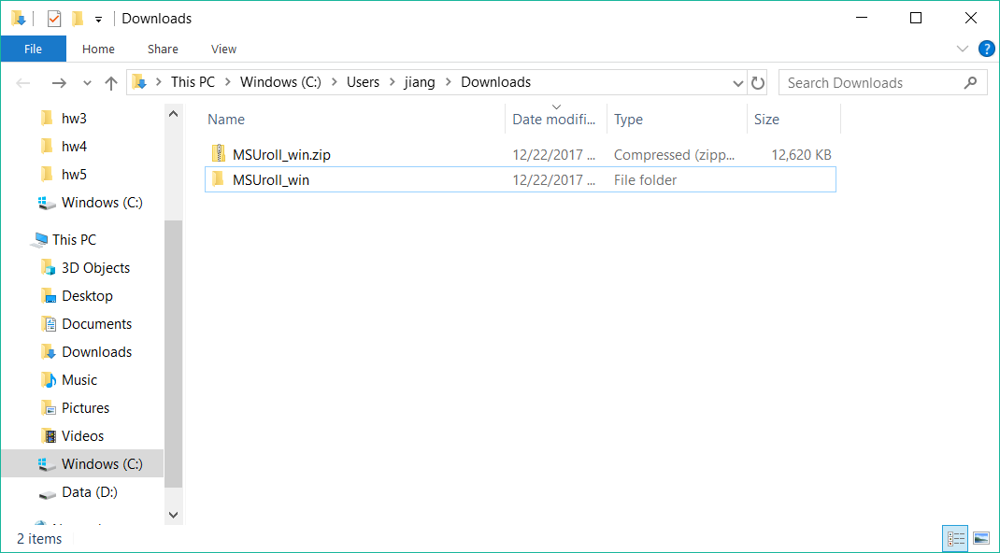
>
> 打开 `MSUroll_win` 文件夹，拷贝 `MSUroll` 文件夹
>
> 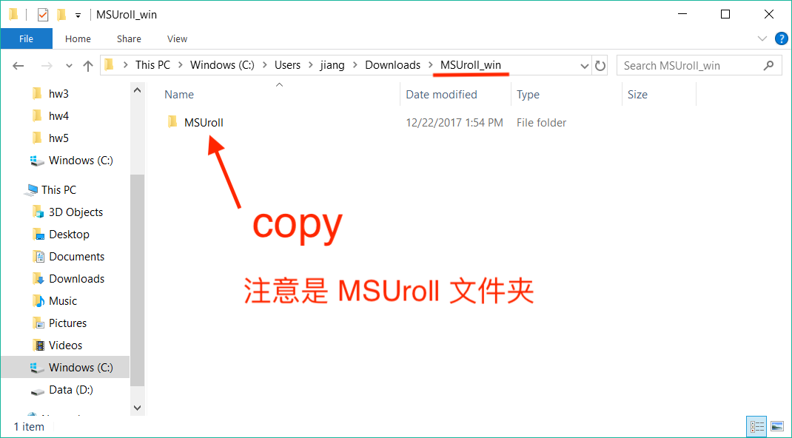
>
> 将 `MSUroll` 文件夹粘贴至 `C盘` *（必须是 **C盘** exactly）*
>
> 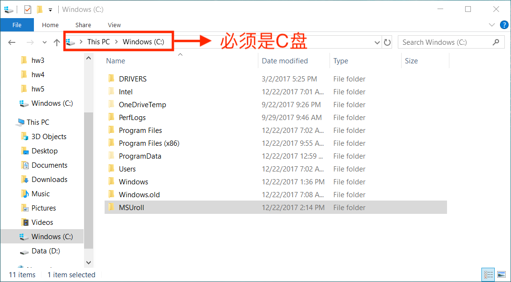
>
> 打开 `MSUroll` 文件夹，找到 `MSUroll.exe` 文件， 右击创建桌面快捷方式
>
> 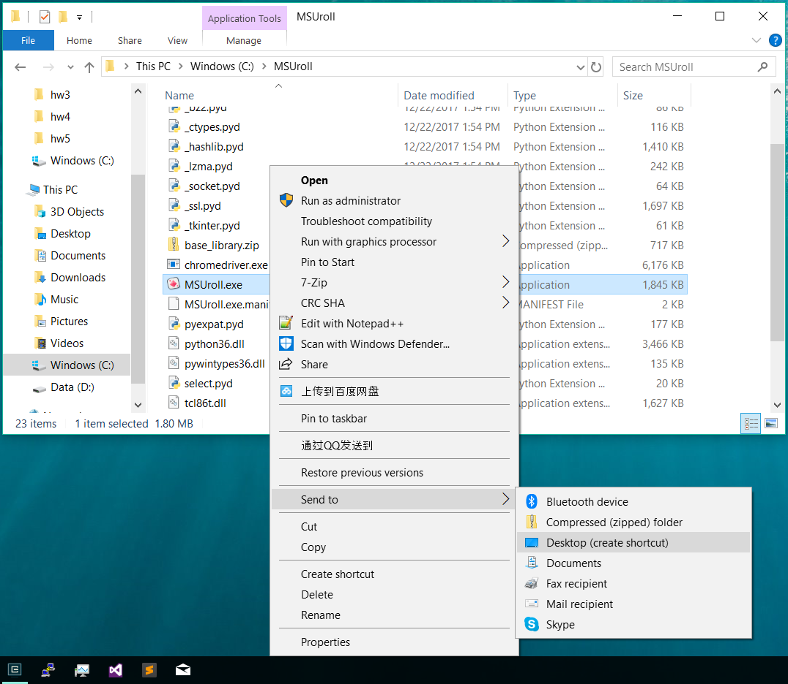
>
> 回到电脑桌面，你将看到
>
> 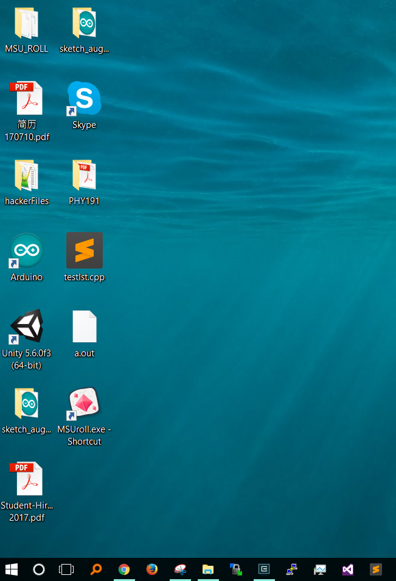
>
> 打开 `MSUroll.exe`
>
> 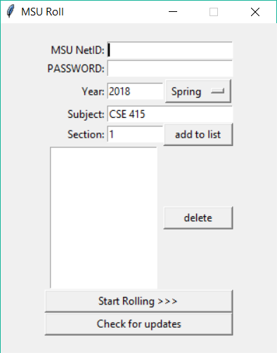
>
> 如果碰到以下问题：
>
> 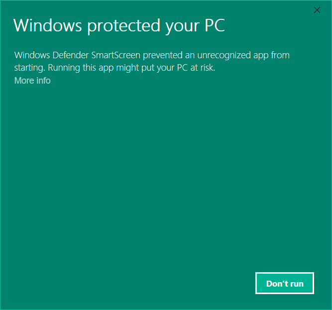
>
> 解决方案：
>
> 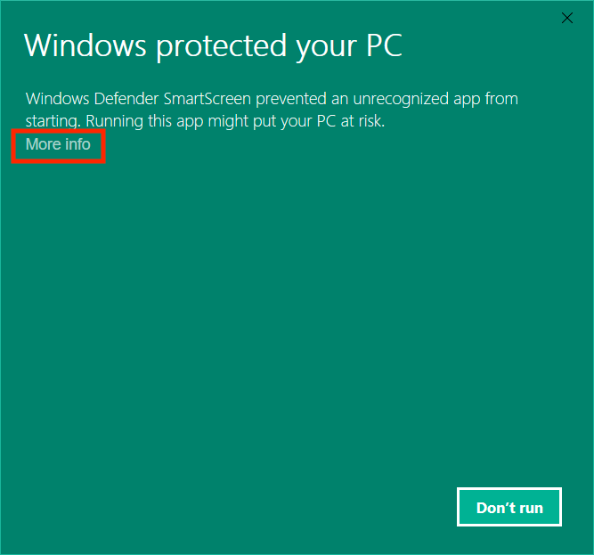
>
> 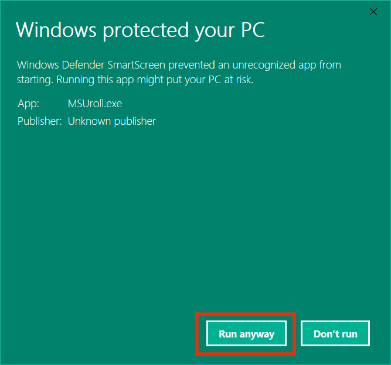
>

**step 3：传送至[使用说明](#intro)**


# <a name="intro"/>
## 使用说明
> ### 声明：
> **MSUroll 需要实时监测是否有人drop了课，为了保证能在第一时间抢到课，必须保持电脑持续开机和连网。最理想的状态是，每次重新打开电脑或者断网后重新连接后，必须关闭 MSUroll， 重新打开，重新选课，开启 自动抢课 状态后，可以选择最小化，然后可以放心去做其他事情。**
>
> ---
> ### windows 用户请注意
>> 如果有以下类似弹窗，属于正常现象，请选择 **忽略** 或者 **最小化**，***千万不能关闭***
>
> 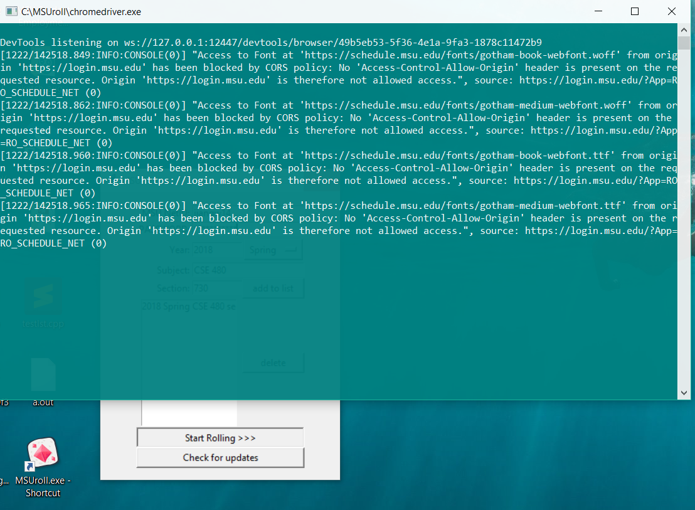
>
> ---
>
> ### 选课
>
> 
>
> 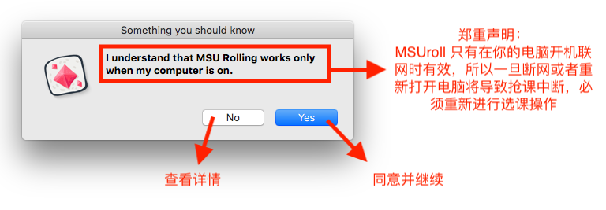
>
> ---
>
> ### 抢课
>
> 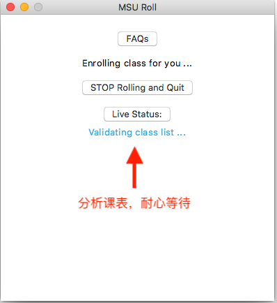
>
> 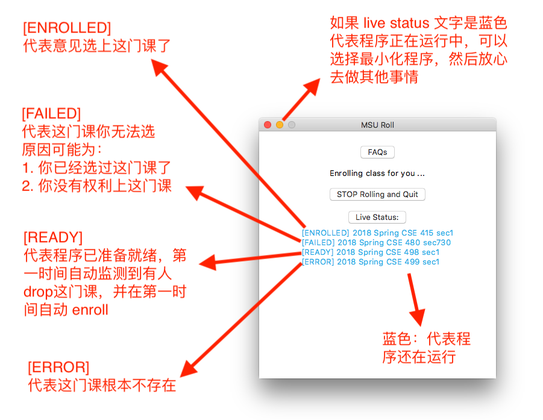
>
> 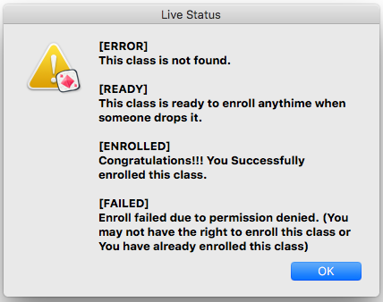
>
> 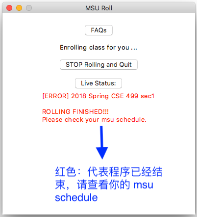
>

# <a name="feedback" />
## 问题反馈与技术交流：

`email` : jevin0change@gmail.com
